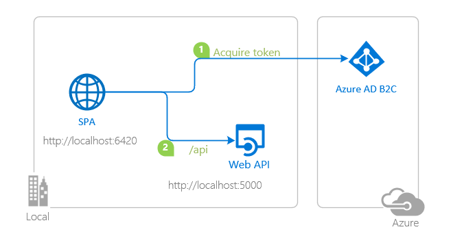

# A sample demonstrating how to protect a Node.js Web API with Azure AD B2C using the Passport.js library

 1. [Overview](#overview)
 1. [Scenario](#scenario)
 1. [Contents](#contents)
 1. [Prerequisites](#prerequisites)
 1. [Setup](#setup)
 1. [Registration](#registration)
 1. [Running the sample](#running-the-sample)
 1. [Explore the sample](#explore-the-sample)
 1. [About the code](#about-the-code)
 1. [More information](#more-information)
 1. [Community Help and Support](#community-help-and-support)
 1. [Contributing](#contributing)

## Overview

This sample demonstrates [how to protect a Node.js Web API](https://docs.microsoft.com/azure/active-directory/develop/quickstart-configure-app-expose-web-apis) with [Microsoft identity platform](https://docs.microsoft.com/azure/active-directory/develop/) and [Azure AD B2C](https://docs.microsoft.com/azure/active-directory-b2c/overview) using the [passport-azure-ad](https://github.com/AzureAD/passport-azure-ad) library.

You will need a **client** application for calling the Web API. Choose:

- [JavaScript Single-page Application calling a custom Web API with MSAL.js 2.x using the auth code flow with PKCE](https://github.com/Azure-Samples/ms-identity-b2c-javascript-spa).

## Scenario

1. The client application uses the [Microsoft Authentication Library for JavaScript (MSAL.js)](https://github.com/AzureAD/microsoft-authentication-library-for-js) to sign-in a user and obtain a JWT [Access Token](https://docs.microsoft.com/azure/active-directory/develop/access-tokens) from **Azure AD B2C**.
1. The **Access Token** is used as a *bearer* token to authenticate the user when calling this web API.
1. The web API responds with the name of the user obtained from the token claims.



## Contents

| File/folder          | Description                                               |
|----------------------|-----------------------------------------------------------|
| `config.js`          | Contains configuration parameters for the sample.         |
| `index.js`           | Main application logic resides here.                      |
| `process.json`       | Contains configuration parameters for logging via Morgan. |

## Prerequisites

- [Node.js](https://nodejs.org/en/download/) must be installed to run this sample.
- A modern web browser. This sample uses **ES6** conventions and will not run on **Internet Explorer**.
- [Visual Studio Code](https://code.visualstudio.com/download) is recommended for running and editing this sample.
- [VS Code Azure Tools](https://marketplace.visualstudio.com/items?itemName=ms-vscode.vscode-node-azure-pack) extension is recommended for interacting with Azure through VS Code Interface.
- An **Azure AD B2C** tenant. For more information see: [How to get an Azure AD B2C tenant](https://docs.microsoft.com/azure/active-directory-b2c/tutorial-create-tenant)
- A user account in your **Azure AD B2C**. This sample will not work with a **personal Microsoft account**. Therefore, if you signed in to the [Azure portal](https://portal.azure.com) with a personal account and have never created a user account in your directory before, you need to do that now.

## Setup

### Step 1: Clone or download this repository

From your shell or command line:

```console
    git clone https://github.com/Azure-Samples/active-directory-b2c-javascript-nodejs-webapi.git
```

or download and extract the repository .zip file.

> :warning: Given that the name of the sample is quite long, and so are the names of the referenced packages, you might want to clone it in a folder close to the root of your hard drive, to avoid maximum file path length limitations on Windows.

### Step 2: Install project dependencies

```console
    cd active-directory-b2c-javascript-nodejs-webapi
    npm install
```

### Register the sample application(s) with your Azure Active Directory tenant

:warning: This sample comes with a pre-registered application for testing purposes. If you would like to use your own **Azure AD B2C** tenant and application, follow the steps below to register and configure the application in the **Azure Portal**. Otherwise, continue with the steps for [Running the sample](#running-the-sample).

### Choose the Azure AD tenant where you want to create your applications

As a first step you'll need to:

1. Sign in to the [Azure portal](https://portal.azure.com).
1. If your account is present in more than one Azure AD B2C tenant, select your profile at the top right corner in the menu on top of the page, and then **switch directory** to change your portal session to the desired Azure AD B2C tenant.

### Create User Flows and Custom Policies

Please refer to: [Tutorial: Create user flows in Azure Active Directory B2C](https://docs.microsoft.com/azure/active-directory-b2c/tutorial-create-user-flows)

### Add External Identity Providers

Please refer to: [Tutorial: Add identity providers to your applications in Azure Active Directory B2C](https://docs.microsoft.com/azure/active-directory-b2c/tutorial-add-identity-providers)

### Register the service app (active-directory-b2c-javascript-nodejs-webapi)

1. Navigate to the [Azure portal](https://portal.azure.com) and select the **Azure AD B2C** service.
1. Select the **App Registrations** blade on the left, then select **New registration**.
1. In the **Register an application page** that appears, enter your application's registration information:
   - In the **Name** section, enter a meaningful application name that will be displayed to users of the app, for example `active-directory-b2c-javascript-nodejs-webapi`.
   - Under **Supported account types**, select **Accounts in any organizational directory only**.
1. Select **Register** to create the application.
1. In the app's registration screen, find and note the **Application (client) ID**. You use this value in your app's configuration file(s) later in your code.
1. Select **Save** to save your changes.
1. In the app's registration screen, select the **Expose an API** blade to the left to open the page where you can declare the parameters to expose this app as an API for which client applications can obtain [access tokens](https://docs.microsoft.com/azure/active-directory/develop/access-tokens) for.
The first thing that we need to do is to declare the unique [resource](https://docs.microsoft.com/azure/active-directory/develop/v2-oauth2-auth-code-flow) URI that the clients will be using to obtain access tokens for this API. To declare an resource URI, follow the following steps:
   - Click `Set` next to the **Application ID URI** to generate a URI that is unique for this app.
   - For this sample, accept the proposed Application ID URI (api://{clientId}) by selecting **Save**.
1. All APIs have to publish a minimum of one [scope](https://docs.microsoft.com/azure/active-directory/develop/v2-oauth2-auth-code-flow#request-an-authorization-code) for the client's to obtain an access token successfully. To publish a scope, follow the following steps:
   - Select **Add a scope** button open the **Add a scope** screen and Enter the values as indicated below:
        - For **Scope name**, use `demo.read`.
        - For **Admin consent display name** type `Access active-directory-b2c-javascript-nodejs-webapi`
        - For **Admin consent description** type `Allows the app to access active-directory-b2c-javascript-nodejs-webapi as the signed-in user.`
        - Keep **State** as **Enabled**
        - Click on the **Add scope** button on the bottom to save this scope.
1. On the right side menu, select the `Manifest` blade.
   - Set `accessTokenAcceptedVersion` property to **2**.
   - Click on **Save**.

#### Configure the service app (active-directory-b2c-javascript-nodejs-webapi) to use your app registration

Open the project in your IDE (like Visual Studio or Visual Studio Code) to configure the code.

> In the steps below, "ClientID" is the same as "Application ID" or "AppId".

1. Open the `config.json` file.
1. Find the key `tenantName` and replace the existing value with your **Azure AD B2C** tenant's name e.g. `fabrikamb2c`.
1. Find the key `clientID` and replace the existing value with the application ID (clientId) of the `active-directory-b2c-javascript-nodejs-webapi` application copied from the **Azure Portal**.
1. Find the key `policyName` and replace the existing value with name of the policy you've created, e.g. `B2C_1_SUSI`.

## Running the sample

```console
    cd active-directory-b2c-javascript-nodejs-webapi
    npm start
```

## Explore the sample

Call this web API from your client application. Upon an authorized call, the web API will respond by:

```javascript
      res.status(200).json({'name': req.authInfo['name']});
```

> :information_source: Did the sample not work for you as expected? Then please reach out to us using the [GitHub Issues](../../../../issues) page.

## We'd love to hear from you

Consider taking a moment to [share your experience with us](https://forms.office.com/Pages/ResponsePage.aspx?id=v4j5cvGGr0GRqy180BHbR73pcsbpbxNJuZCMKN0lURpURFBLRlBRMk9ZMjFDOFA4UVBVOE9TVExJSSQlQCN0PWcu).

## About the code

### Token Validation

[passport-azure-ad](https://github.com/AzureAD/passport-azure-ad) validates the token against the `issuer`, `scope` and `audience` claims (defined in `BearerStrategy` constructor) using the `passport.authenticate()` API:

```javascript
    app.get('/hello', passport.authenticate('oauth-bearer', { session: false }),
        (req, res) => {
            console.log('Validated claims: ', req.authInfo);
    );
```

## More information

- [What is Azure Active Directory B2C?](https://docs.microsoft.com/azure/active-directory-b2c/overview)
- [Application types that can be used in Active Directory B2C](https://docs.microsoft.com/azure/active-directory-b2c/application-types)
- [Recommendations and best practices for Azure Active Directory B2C](https://docs.microsoft.com/azure/active-directory-b2c/best-practices)
- [Azure AD B2C session](https://docs.microsoft.com/azure/active-directory-b2c/session-overview)
- [Initialize client applications using MSAL.js](https://docs.microsoft.com/azure/active-directory/develop/msal-js-initializing-client-applications)
- [Single sign-on with MSAL.js](https://docs.microsoft.com/azure/active-directory/develop/msal-js-sso)
- [Handle MSAL.js exceptions and errors](https://docs.microsoft.com/azure/active-directory/develop/msal-handling-exceptions?tabs=javascript)
- [Logging in MSAL.js applications](https://docs.microsoft.com/azure/active-directory/develop/msal-logging?tabs=javascript)
- [Pass custom state in authentication requests using MSAL.js](https://docs.microsoft.com/azure/active-directory/develop/msal-js-pass-custom-state-authentication-request)
- [Prompt behavior in MSAL.js interactive requests](https://docs.microsoft.com/azure/active-directory/develop/msal-js-prompt-behavior)
- [Use MSAL.js to work with Azure AD B2C](https://docs.microsoft.com/azure/active-directory/develop/msal-b2c-overview)

For more information about how OAuth 2.0 protocols work in this scenario and other scenarios, see [Authentication Scenarios for Azure AD](https://docs.microsoft.com/azure/active-directory/develop/authentication-flows-app-scenarios).

## Community Help and Support

Use [Stack Overflow](http://stackoverflow.com/questions/tagged/msal) to get support from the community.
Ask your questions on Stack Overflow first and browse existing issues to see if someone has asked your question before.
Make sure that your questions or comments are tagged with [`azure-active-directory` `azure-ad-b2c` `ms-identity` `adal` `msal`].

If you find a bug in the sample, please raise the issue on [GitHub Issues](../../issues).

To provide a recommendation, visit the following [User Voice page](https://feedback.azure.com/forums/169401-azure-active-directory).

## Contributing

If you'd like to contribute to this sample, see [CONTRIBUTING.MD](/CONTRIBUTING.md).

This project has adopted the [Microsoft Open Source Code of Conduct](https://opensource.microsoft.com/codeofconduct/). For more information, see the [Code of Conduct FAQ](https://opensource.microsoft.com/codeofconduct/faq/) or contact [opencode@microsoft.com](mailto:opencode@microsoft.com) with any additional questions or comments.
