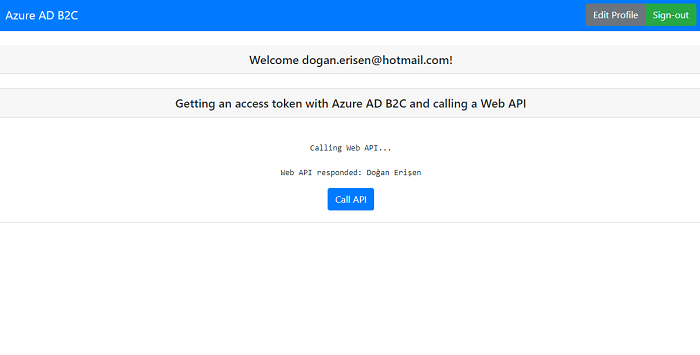

# Node.js Web API with Azure AD B2C

This sample demonstrates how to protect a Node.js web API with Azure AD B2C using the Passport.js library. The code here is pre-configured with a registered client ID. If you register your own app, replace the client ID.

To see how to call this web API from a client application, refer to this [B2C Single Page Application sample](https://github.com/Azure-Samples/active-directory-b2c-javascript-msal-singlepageapp).

## Contents

| File/folder          | Description                                               |
|:---------------------|:----------------------------------------------------------|
| `.gitignore`         | Defines what to ignore at commit time.                    |
| `CHANGELOG.md`       | List of changes to the sample.                            |
| `CODE_OF_CONDUCT.md` | Code of Conduct information.                              |
| `config.js`          | Contains configuration parameters for the sample.         |
| `CONTRIBUTING.md`    | Guidelines for contributing to the sample.                |
| `index.js`           | Main application logic resides here.                      |
| `LICENSE`            | The license for the sample.                               |
| `package.json`       | Package manifest for npm.                                 |
| `process.json`       | Contains configuration parameters for logging via Morgan. |
| `README.md`          | This README file.                                         |
| `SECURITY.md`        | Security disclosures.                                     |

## Steps to run

1. Clone this repository.

```console
git clone https://github.com/Azure-Samples/active-directory-b2c-javascript-nodejs-webapi.git
```

2. Install [Node.js](https://nodejs.org/en/download/) if you don't already have it.

3. Install the Node dependencies:

```console
npm install && npm update
```

4. Run the Web API. By default, it runs on `http://localhost:5000`

```console
npm start
```

## Using your own Azure AD B2C tenant

To have a proper understanding of Azure AD B2C as a developer, follow the tutorials in the official [Azure AD B2C documentation](https://docs.microsoft.com/azure/active-directory-b2c/). In the rest of this guide, we summarize the steps you need to go through.

### Step 1: Get your own Azure AD B2C tenant

You first need an Azure AD B2C tenant. If you don't already have one you can use for testing purposes, create your own by following the steps in [Tutorial: Create an Azure Active Directory B2C tenant](https://docs.microsoft.com/azure/active-directory-b2c/tutorial-create-tenant).

### Step 2: Create your own policies

This sample uses a unified sign-up/sign-in policy. You can create [your own unified sign-up/sign-in policy](https://docs.microsoft.com/azure/active-directory-b2c/tutorial-create-user-flows). You may choose to include as many or as few identity providers as you wish.

If you already have existing policies in your Azure AD B2C tenant, feel free to reuse those policies in this sample.



#### Step 3: Register your own web API with Azure AD B2C

Follow the steps in [Protect and grant access to a Node.js web API](https://docs.microsoft.com/azure/active-directory-b2c/tutorial-single-page-app-webapi) to register the web API application in your tenant, define scopes, and grant a web application access to the API. By following the steps in the tutorial, you define the scopes that your single-page application will request access tokens for.

#### Step 4: Configure your application source code

You can now fill in the variables in the *config.js* file of the Node.js web API sample with the parameters you've obtained from the Azure portal by following the steps above.

Configure the following variables:

```javascript
const clientID = "<Application (client) ID of your Node.js web API, e.g. 93733604-0000-0000-0000-87084dd55348>"
const b2cDomainHost = "<Domain name of your B2C authority, e.g. fabrikamb2c.b2clogin.com>";
const tenantId = "<Domain name of your B2C tenant, e.g. fabrikamb2c.onmicrosoft.com>";
const policyName = "<Name of your sign in / sign up policy. Example: B2C_1_SUSI>";
```

> **NOTE**
>
> Developers using the [Azure China](https://docs.microsoft.com/azure/active-directory/develop/authentication-national-cloud) environment MUST use `<your-tenant-name>.b2clogin.com` authority instead of `login.chinacloudapi.com`.
>
> To use `<your-tenant-name>.b2clogin.*`, you need set `validateIssuer: false`. Learn more about using [b2clogin.com](https://docs.microsoft.com/azure/active-directory-b2c/b2clogin).

### Step 5: Run the application

Lastly, to run your Node.js Web API, execute the following commands in your shell or terminal:

```bash
npm install && npm update
npm start
```

Your Node.js web API is now running on port 5000.

## Questions & issues

Please file any questions or problems with the sample as a GitHub issue. You can also post on Stack Overflow with the tag `azure-ad-b2c`.

## Contributing

If you'd like to contribute to this sample, see [CONTRIBUTING.md](./CONTRIBUTING.md).

## Code of conduct

For details, see [CODE_OF_CONDUCT.md](CODE_OF_CONDUCT.md).
